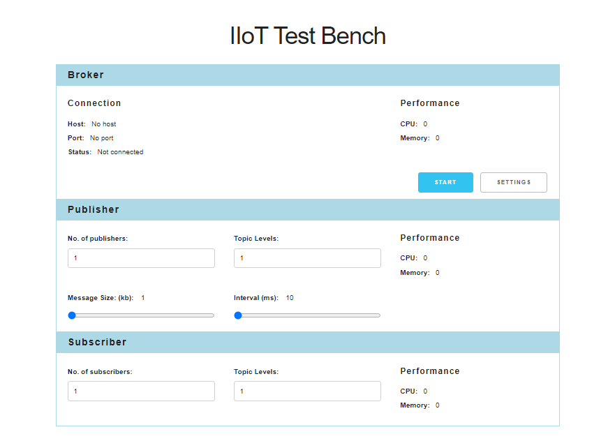
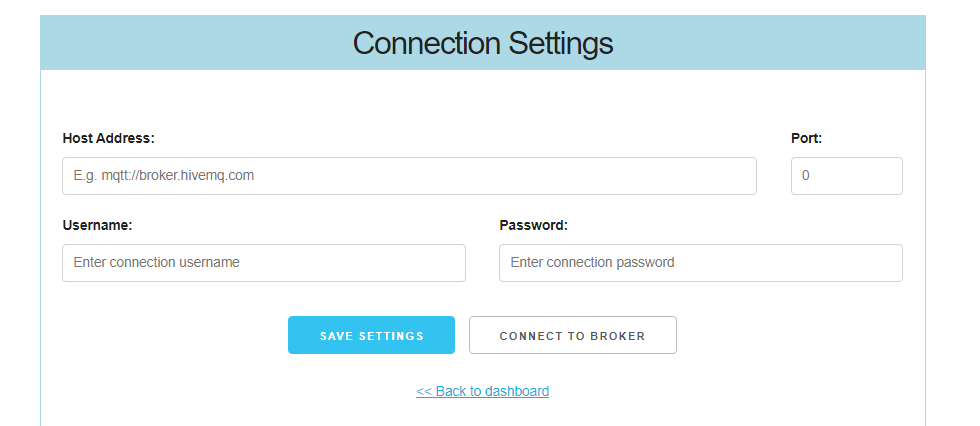

# IIoT Test Bench

Capstone project for [Amalitech Training Academy](https://amalitech.org/ghana-training/) 2022.

> Live demo [_here_](https://amalitech-iiot-test-bench.netlify.app/).

## Table of Contents

* [General Info](#general-information)
* [Technology Used](#technology-used)
* [Features](#features)
* [Screenshot](#screenshot)
* [Setup](#setup)

### General Information

The heart of a IIoT solution is a message broker. Several technologies are available here,  
e.g. MQTT-Broker, Microsoft Azure IoT Hub or Kafka. The risk is that we do not know the limits of these systems in productive use.  
These include performance and load with a very large number of messages, publishing large amounts of data via the broker and  
networks, persistence, security and compression of IoT data. This project seeks to test and visualize IIoT brokers performance in a dashboard.

### Technology Used

* Frontend
  * React - version 18.2.0
  * React-dom - version 18.2.0
  * React-router-dom - version 6.3.0
  * React-redux - version 8.0.2
  * Reduxjs Tookit - version 1.8.5
  * [Skeleton CSS](http://getskeleton.com/) - version 2.0.4
  * Normalize CSS - version 3.0.2

* Backend
  * Expressjs - version 4.18.1
  * Cors - version 2.8.5
  * Mqtt - version 4.3.7
  * Random-Words - version 1.2.0

### Features

* Configure and test connection to broker
* Configure and test publishing and sucbscription
* View publishing and subscription performance report

### Screenshot

Dashboard

Connection Settings

### Setup

Run this command in a terminal (e.g. Git bash recommended for Windows OS) in both frontend and server folder to install dependencies:  
`npm install`

**NB:** [NodeJS](https://nodejs.org/en/) must be installed on your local machine which comes with a package manager **npm** before you can use this command.

Start the application after dependencies have being installed with:
`npm start`
in frontend folder and  
`nodemon server.js`
in backend folder  

**NB:** Nodemon must be installed globally with npm. Install nodemon globally with this command  
`npm install -g nodemon`
